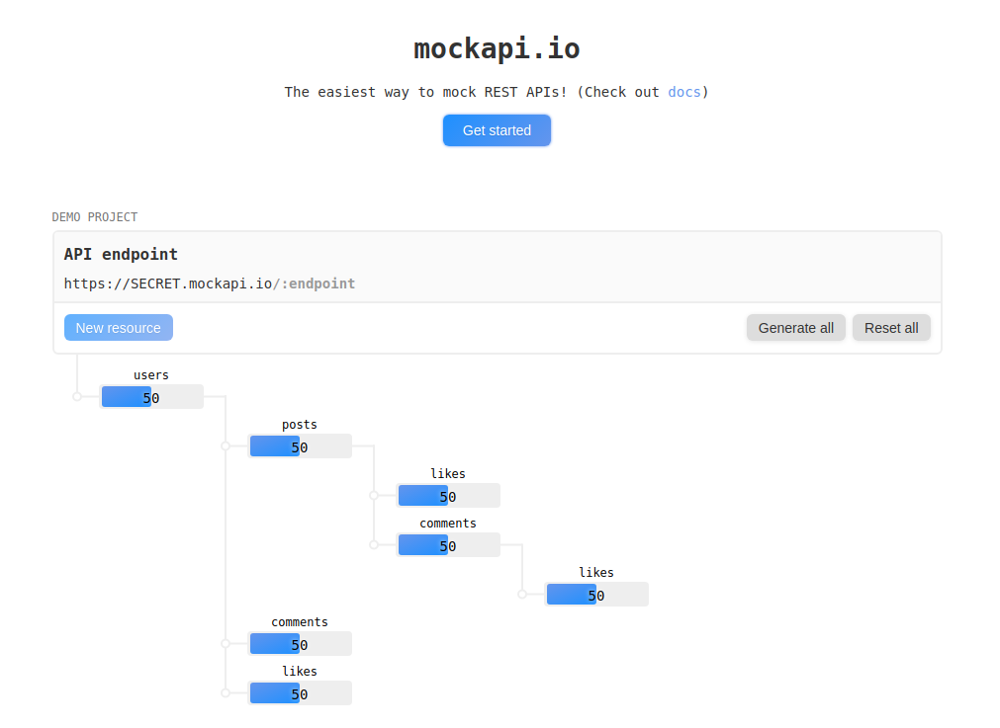
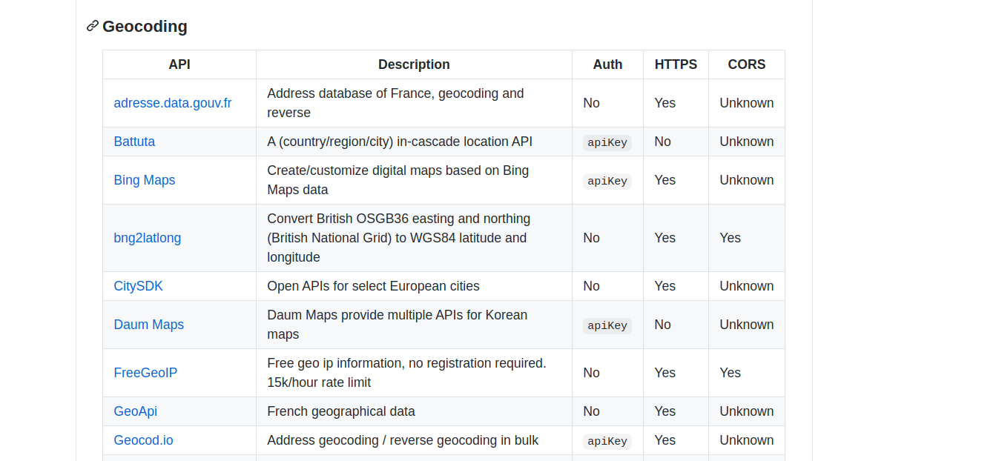

Si estamos en los primeros momentos del desarrollo de una aplicación web, móvil o escritorio y necesitamos contar con el acceso a los datos suministrados por nuestra futura API podemos montar de forma rápida una API REST falsa (fake REST API).

Puede que esta labor la esté desarrollando a la vez el equipo de backend, que vaya a ser facilitada por el cliente en algún momento del desarrollo, que la necesitemos para una demo, o simplemente afrontemos un proyecto personal de desarrollo y la necesitemos.

Si no queremos complicarnos mucho la vida, aunque por lo que he aprendido no es demasiado costoso montar tu propia API de pruebas existen páginas que nos dan la posibibilidad de acceder a este tipo de recursos. He llegado a usar [mockapi](https://www.mockapi.io/) y me ha parecido realmente buena. 



Otra opción es usar alguna de las múltiples API con cientos de temáticas que existen. Una buena recopilación se puede encontrar en este repositorio de Github. https://github.com/public-apis/public-apis organizada por temáticas tipo animales, juegos, geocodificación, noticias...



A pesar de los recursos existentes, que sin duda nos facilitarían la vida, vamos a montar nuestro propia API con divesos paquetes JavaScript muy conocidos como JSON server o Faker. Puede ocurrir que queramos que los datos sean los más parecidos a los que nos ofrecerá la API en producción o, simplemente, queremos aprender nuevas habilidades en el ámbito del desarrollo frontend ¿porqué no?.

## Montando una API de prueba JSON Server

JSON Server es una verdadera maravilla. Gracias a este módulo, y como podéis encontrar en muchas entradas, en menos de 5 minutos podéis tener una Fake API funcionando y que permite no solo realizar peticiones de tipo GET, sino también crear (POST), actualizar(PUT) o borrar (DELETE) datos.

Por si fuera poco, podremos acceder al listado de objetos, buscar por ID o por alguno de sus campos, filtrar, ordenar, añadir rutas personalizadas...

Por mucho que quiera, no voy a poder mejorar la [documentación el módulo](https://github.com/typicode/json-server#routes) que además contiene gran cantidad de ejemplos.

El primer paso es la instalación del módulo con Node o Yarm en nuestro proyecto,

```
npm install json-server
```

Creamos ahora el archivo json (ej. db.json) que contendrá nuestros datos

```json
{
  "shop": [
    { "id": 1, "address": "Calle Juan Martín", "type": "frutería", "nombre": "Frutería Lola", "longitude": 37.892306, "latitude": -4.7795159 },
    { "id": 2, "address": "Calle Pepe Cruz", "type": "Supermercado", "nombre": "Ultramarinos Chacho", "longitude": 37.862323, "latitude": -4.77812 },
  ],
  "products": [
    { "id": 1, "name": "manzanas", "shopId": 1 }
    { "id": 2, "name": "peras", "shopId": 1 }
    { "id": 3, "name": "escoba", "shopId": 2 }
    { "id": 4, "name": "detergente", "shopId": 2 }
  ],
}

```

Ponemos en marcha nuestra API

```
json-server --watch db.json
```

JSON Schema

npm install json-schema-faker
npm install faker